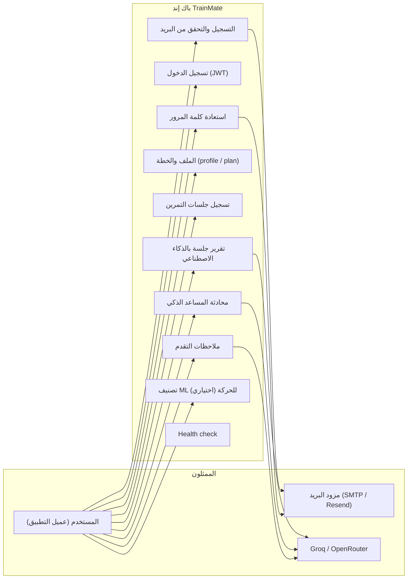
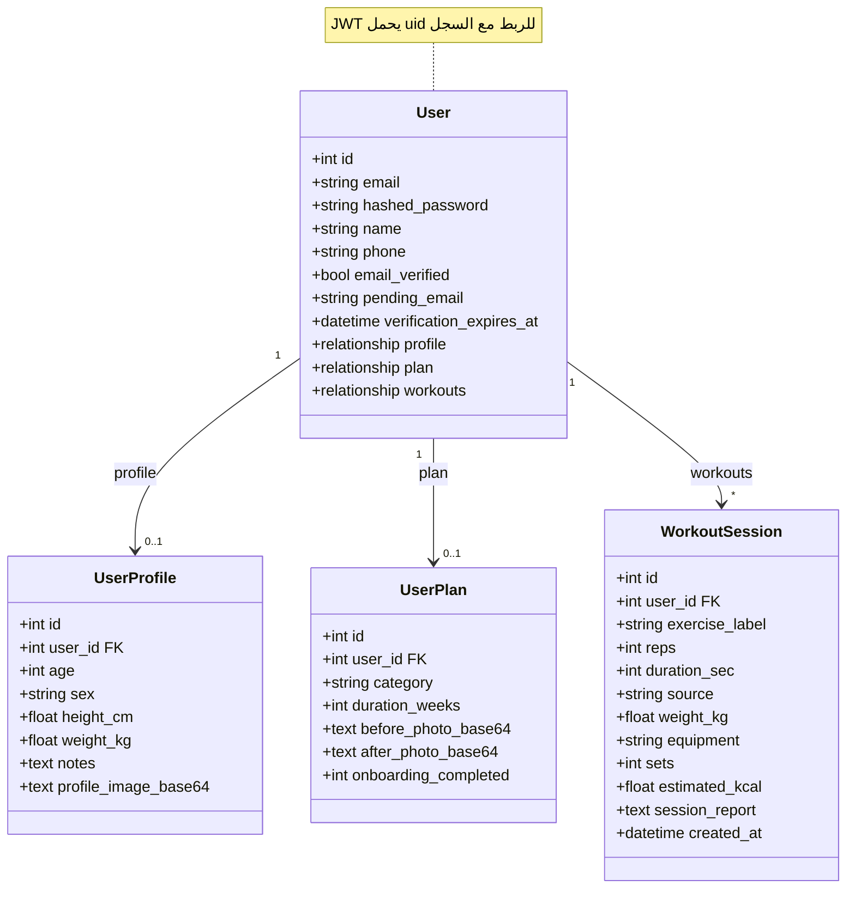
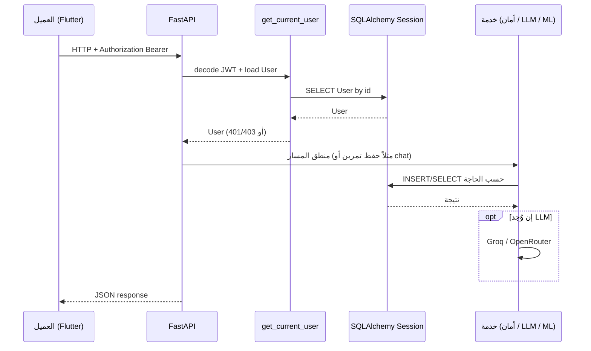
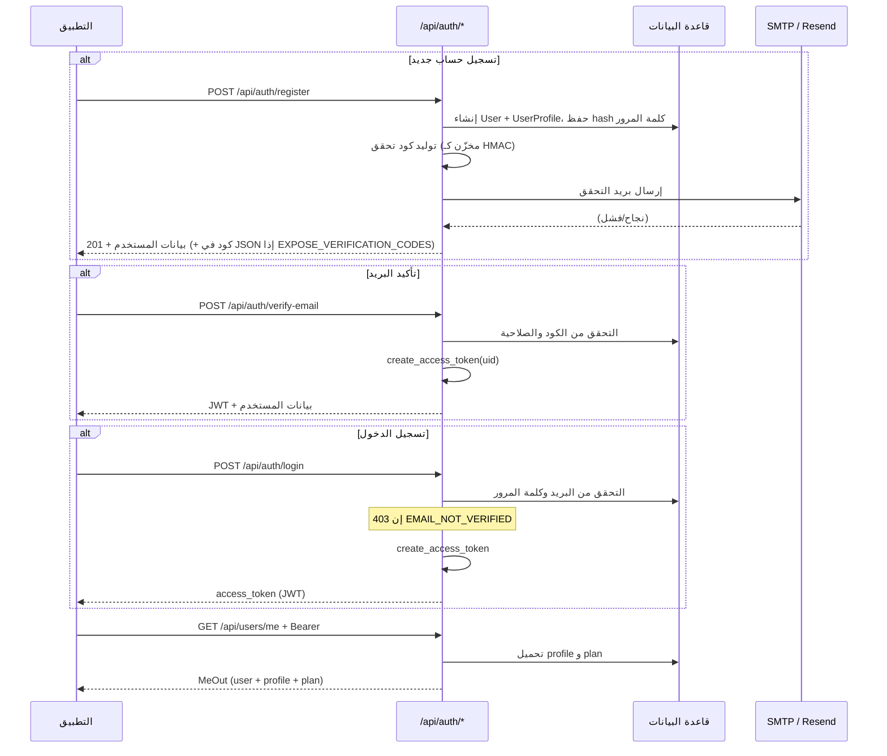
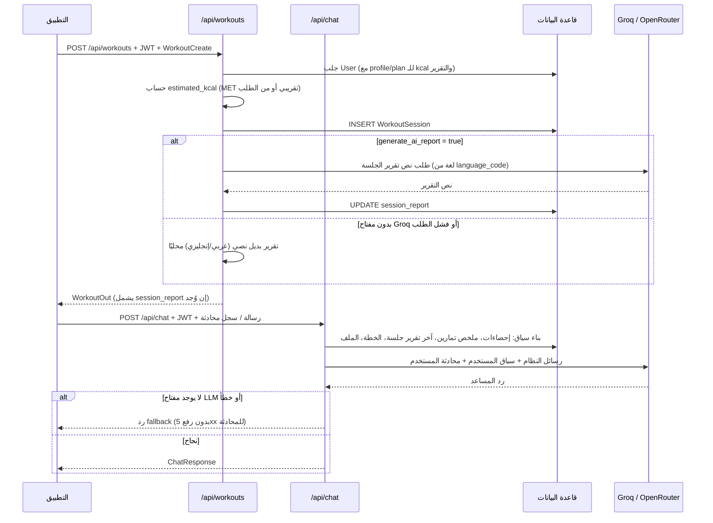

# توثيق باك إند TrainMate (FastAPI)

هذا الملف يشرح **باك إند تطبيق TrainMate**: ماذا يفعل، كيف يعمل، المكونات، إدارة البيانات، ونقاط الـ API الرئيسية — مع مخططات **Use Case** و**Class** و**Sequence** (بما فيها المصادقة والتهيئة، وإنهاء التمرين مع الشات بوت).

---

## 1. نظرة عامة

- **الإطار**: [FastAPI](https://fastapi.tiangolo.com/) على Python، يعمل عبر **Uvicorn**.
- **الواجهة**: REST تحت البادئة **`/api`** مع **JWT (Bearer)** للمسارات المحمية.
- **قاعدة البيانات**: **SQLAlchemy 2** مع SQLite افتراضيًا (`sqlite:///./trainmate.db`) — يمكن تغيير `DATABASE_URL` لقاعدة أخرى مدعومة.
- **الذكاء الاصطناعي**:
  - **Groq** (`groq`) لتوليد تقارير الجلسات ولـ chat المساعد.
  - **OpenRouter** (عبر عميل `openai`) كبديل اختياري حسب الإعدادات.
- **البريد**: إرسال أكواد التحقق وإعادة تعيين كلمة المرور عبر **SMTP** أو **Resend** (`app/email_delivery.py`).
- **تعلم الآلة على السيرفر** (اختياري): تصنيف تمارين من نافذة Pose عبر **TensorFlow/Keras** إذا وُجدت الأوزان تحت `ai/models/` أو `ML_MODELS_DIR`.

**تشغيل محلي (من مجلد `trainmate_backend`):**

```bash
.venv\Scripts\activate
pip install -r requirements.txt
copy .env.example .env   # ثم ضبط JWT_SECRET_KEY و GROQ_API_KEY وغيرها
uvicorn app.main:app --reload --host 0.0.0.0 --port 8000
```

**فحص الصحة:** `GET http://127.0.0.1:8000/api/health`

---

## 2. مخطط حالات الاستخدام (Use Case Diagram)

يعرض الأدوار الرئيسية والتفاعلات مع النظام (المستخدم عبر تطبيق Flutter/الويب، والخدمات الخارجية).



---

## 3. مخطط الصفوف (Class Diagram)

يعكس **طبقة النموذج (ORM)** والعلاقات، مع أهم الطبقات المجاورة في التطبيق.



**طبقات إضافية (ليست كلها صفوف ORM):**

| طبقة | الملفات / الدور |
|------|------------------|
| Routers | `app/routers/auth.py`, `users.py`, `workouts.py`, `chat.py`, `ml.py` — تعريف المسارات |
| Schemas | `app/schemas.py` — Pydantic للطلبات والاستجابات |
| Security | `app/security.py` — bcrypt، JWT، HMAC لأكواد البريد |
| Dependencies | `app/deps.py` — استخراج المستخدم الحالي من Bearer |
| Config | `app/config.py` — إعدادات البيئة (`.env`) |
| Email | `app/email_delivery.py` — إرسال الرسائل |
| Verification | `app/verification.py` — توليد/حدود إعادة الإرسال للأكواد |

---

## 4. مخطط تسلسل عام (طلب محمي نموذجي)

من لحظة إرسال الطلب حتى الاستجابة من قاعدة البيانات و/أو الـ LLM.



---

## 5. مخطط تسلسل: المصادقة والتهيئة (Authentication & Initialization)

يتضمن: تسجيلًا جديدًا مع التحقق بالبريد، أو تسجيل دخول بعد التحقق، ثم استخدام الـ token للوصول إلى `/users/me`.



**ملاحظات تنفيذية:**

- **`get_current_user`** في `app/deps.py` يرفض الطلب إن لم يكن هناك Bearer صالح، أو إن **`email_verified`** ليس `true`.
- تغيير البريد من **`PATCH /api/users/me/account`** قد يضع **`pending_email`** ويرسل كود تحقق للبريد الجديد (مشابه لتدفق التسجيل).

---

## 6. مخطط تسلسل: إنهاء التمرين وتفاعل الشات بوت

يجمع بين حفظ الجلسة (`POST /api/workouts`) وتوليد تقرير اختياري بالـ AI، ثم محادثة المساعد (`POST /api/chat`) التي تُحقن بسياق المستخدم من قاعدة البيانات.



**نقطة إضافية:** يوجد **`GET /api/chat/progress-feedback?lang=`** يولّد ملخص تقدم قصير من بيانات التمارين والملف (مع نفس منطق الـ provider والـ fallback).

---

## 7. الوحدات الأساسية والتقنيات (Core Backend Modules & Technologies)

| المكون | التقنية | الوظيفة |
|--------|---------|---------|
| إطار الويب | FastAPI | مسارات REST، تحقق Pydantic، OpenAPI تلقائي |
| الخادم | Uvicorn | تشغيل ASGI |
| ORM | SQLAlchemy 2 | نماذج `User`, `UserProfile`, `UserPlan`, `WorkoutSession` |
| المصادقة | python-jose + bcrypt | JWT HS256، تشفير كلمات المرور |
| إعدادات | pydantic-settings | قراءة `.env` |
| ذكاء اصطناعي | groq، openai (OpenRouter) | تقارير الجلسات، الشات، ملاحظات التقدم |
| CORS | CORSMiddleware | السماح للعميل (الويب/المحمول) بالاتصال |
| بريد | SMTP أو Resend API | تحقق البريد، إعادة التعيين |
| ML اختياري | tensorflow-cpu، joblib، numpy | `/api/ml/classify` عند توفر النماذج |

**مسارات الراوتر المجمّعة في `app/main.py`:**

- `/api/auth/*`
- `/api/users/*`
- `/api/workouts/*`
- `/api/chat/*`
- `/api/ml/*`
- `/api/health`

---

## 8. إدارة البيانات في الباك إند (Backend Data Management)

### 8.1 تهيئة الجداول والترحيل الخفيف لـ SQLite

- عند الإقلاع: `Base.metadata.create_all(bind=engine)` ينشئ الجداول إن لم تكن موجودة.
- دالة **`_ensure_sqlite_columns()`** تضيف أعمدة جديدة للجداول القديمة في SQLite (ترقية بدون Alembic — مناسب للتطوير السريع).

### 8.2 الجداول والعلاقات

- **`users`**: الهوية، كلمة المرور، حالة التحقق، أكواد التحقق/إعادة التعيين (مخزنة كـ hash).
- **`user_profiles`**: بيانات جسدية وملاحظات وصورة profile بصيغة base64.
- **`user_plans`**: فئة الخطة، المدة بالأسابيع، صور قبل/بعد، اكتمال الـ onboarding.
- **`workout_sessions`**: كل سجل تمرين مع حقول إضافية (وزن، معدات، مجموعات، سعرات، تقرير نصي).

### 8.3 الجلسات (Sessions)

- `get_db()` يفتح جلسة SQLAlchemy لكل طلب ويغلقها بعد الانتهاء — نمط شائع مع FastAPI.

### 8.4 الأسرار والبيئة

أهم المتغيرات (انظر `app/config.py` و `.env.example`):

- `JWT_SECRET_KEY`, `JWT_ALGORITHM`, `ACCESS_TOKEN_EXPIRE_MINUTES`
- `DATABASE_URL`
- `GROQ_API_KEY`, `GROQ_MODEL`, `LLM_PROVIDER`, `OPENROUTER_*`
- `SMTP_*` أو `RESEND_API_KEY`
- `EXPOSE_VERIFICATION_CODES` (للتطوير: إرجاع كود التحقق في JSON)
- `ML_MODELS_DIR` (مسار اختياري لأوزان Keras)

---

## 9. جدول مختصر لأهم نقاط API

| الطريقة | المسار | الحماية | الغرض |
|---------|--------|---------|--------|
| GET | `/api/health` | لا | حالة الخدمة وإعداد البريد/الـ LLM |
| POST | `/api/auth/register` | لا | تسجيل + إرسال تحقق |
| POST | `/api/auth/login` | لا | JWT بعد التحقق |
| POST | `/api/auth/verify-email` | لا | إتمام التحقق + JWT |
| POST | `/api/auth/resend-verification` | لا | إعادة إرسال الكود |
| POST | `/api/auth/forgot-password` | لا | طلب كود إعادة تعيين |
| POST | `/api/auth/reset-password` | لا | تعيين كلمة مرور جديدة |
| GET | `/api/users/me` | Bearer | المستخدم + الملف + الخطة |
| PATCH | `/api/users/me/profile` | Bearer | تحديث الملف |
| PATCH | `/api/users/me/account` | Bearer | الاسم/الهاتف/البريد/كلمة المرور |
| PATCH | `/api/users/me/plan` | Bearer | الخطة والصور و onboarding |
| POST | `/api/workouts` | Bearer | إنشاء جلسة + تقرير AI اختياري |
| GET | `/api/workouts` | Bearer | قائمة آخر التمارين |
| POST | `/api/chat` | Bearer | محادثة مع سياق المستخدم |
| POST | `/api/chat/progress-feedback` | Bearer | ملاحظات تقدم مختصرة |
| GET | `/api/ml/status` | لا (أو حسب النشر) | هل الملفات موجودة |
| POST | `/api/ml/classify` | Bearer | تصنيف نافذة pose |

---

## 10. إضافات مفيدة

- **الأمان**: كلمات المرور بـ bcrypt؛ أكواد البريد عبر HMAC؛ لا يُعاد كود إعادة التعيين في JSON (عكس التحقق عند التطوير).
- **مرونة الـ LLM**: `LLM_PROVIDER=auto` يختار OpenRouter إن وُجد مفتاح، وإلا Groq.
- **الشات**: يبني سياقًا غنيًا من آخر التمارين والإحصاءات لتقليل “الاختلاق” — مع قواعد في الـ system prompts.
- **التمرين**: تقدير السعرات يعتمد MET تقريبي حسب اسم التمرين ووزن الجسم إن وُجد.

---

*آخر تحديث يعتمد على الكود في المستودع (`trainmate_backend/app`). إذا غيّرت المسارات أو النماذج، حدّث هذا الملف بنفس الوقت.*
